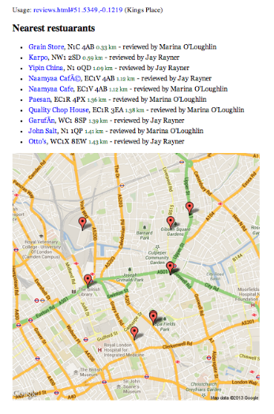

Calculate the nearest thing to a target thing.



Eg, Given an array of objects, each with a lat/lon property, the module will sort the list by geographic distance to a given set of co-ordinates. 

```
  [
    {
        "path": "lifeandstyle/2012/jan/08/jay-rayner-restaurant-review-create",
        "restaurant": "Create",
        "lat": "53.797331",
        "lon": "-1.549829"
    },
    {
        "path": "lifeandstyle/2012/jan/06/granger-and-co-restaurant-review",
        "reviewer": "John Lanchester",
        "lat": "51.514502",
        "lon": "-0.198357"
    }
    ...
  ]
```

