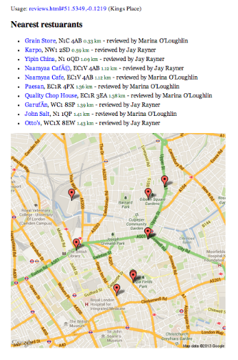

# Nearest.js

Nearest.js is a small utility library for calculating the nearest set of things to a target thing, geospatially speaking. In JavaScript.

## Demo

For example, a list of restaurant reviews near to where you work,



## API

Include in your page,

```
<script src="nearest.js"></script>
```

... and the `Nearest.find` function will return the items in that list sorted approximately in order of the distance from a given coordinate.

```
results = new Nearest().find(dataSource, { coords: [51.5349, -0.1219], limit: 10, within: 3 } )
```

## Data

Nearest.js requires a datasource containing a list of objects, each containing a lat and lon property.

```
  [
    {
        "path": "lifeandstyle/2012/jan/08/jay-rayner-restaurant-review-create",
        "restaurant": "Create",
        "reviewer": "John Lanchester",
        "lat": "53.797331",
        "lon": "-1.549829"
    },
    {
        "path": "lifeandstyle/2012/jan/06/granger-and-co-restaurant-review",
        "reviewer": "John Lanchester",
        "lat": "51.514502",
        "lon": "-0.198357",
        "links": [
            "foo": "http://example.com/foo",
            "bar": "http://example.com/bar"
        ]
    }
    ...
  ]
```

